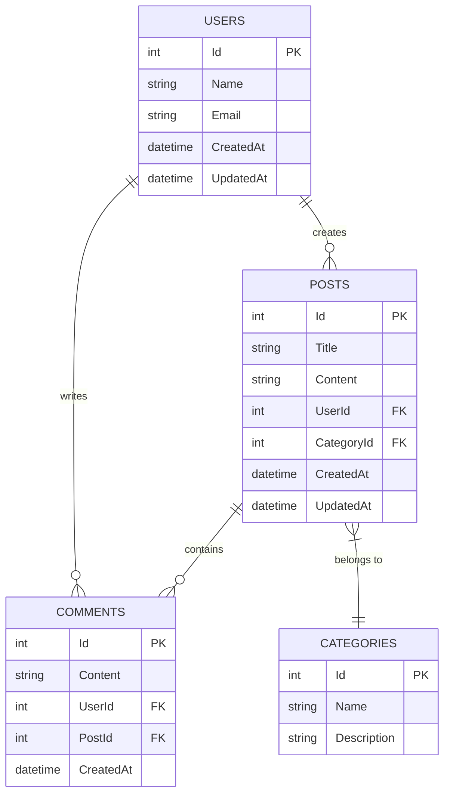
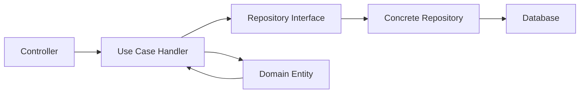

# .NET 9 REST API with Dapper, PostgreSQL, Clean Architecture, and Docker

## 1. Overview

This document outlines the design for a .NET 9 REST API implementing CRUD operations for entities using Dapper as the micro-ORM, PostgreSQL as the database, clean architecture principles, comprehensive unit testing, and Docker containerization.

### 1.1 Objectives

- Implement a RESTful API using .NET 9 with high-performance Dapper ORM
- Use PostgreSQL as the primary database
- Apply clean architecture principles with clear separation of concerns
- Include comprehensive unit testing with Testcontainers for integration tests
- Provide Docker containerization for easy deployment and scalability

### 1.2 Technology Stack

- **Framework**: .NET 9
- **Database**: PostgreSQL
- **ORM**: Dapper (Micro-ORM)
- **Architecture**: Clean Architecture
- **Testing**: xUnit, Moq, Testcontainers
- **Containerization**: Docker, Docker Compose
- **API Documentation**: Swagger/OpenAPI

## 2. Architecture

The solution follows Clean Architecture principles with a clear separation of concerns across multiple layers:

```
┌─────────────────────────────────────────────────────────────┐
│                        API LAYER                            │
│  ┌───────────────────────────────────────────────────────┐  │
│  │                 Web API Controllers                   │  │
│  │  - REST endpoints                                     │  │
│  │  - Request/Response mapping                           │  │
│  │  - HTTP status codes                                  │  │
│  └───────────────────────────────────────────────────────┘  │
├─────────────────────────────────────────────────────────────┤
│                     APPLICATION LAYER                       │
│  ┌───────────────────────────────────────────────────────┐  │
│  │                    Use Cases                          │  │
│  │  - Business logic orchestration                       │  │
│  │  - Request validation                                 │  │
│  │  - DTO mapping                                        │  │
│  └───────────────────────────────────────────────────────┘  │
├─────────────────────────────────────────────────────────────┤
│                      DOMAIN LAYER                           │
│  ┌───────────────────────────────────────────────────────┐  │
│  │                    Entities                           │  │
│  │  - Core business objects                              │  │
│  │  - Business rules and validation                      │  │
│  └───────────────────────────────────────────────────────┘  │
├─────────────────────────────────────────────────────────────┤
│                    INFRASTRUCTURE LAYER                     │
│  ┌───────────────────────────────────────────────────────┐  │
│  │                  Data Access                          │  │
│  │  - Dapper repositories                                │  │
│  │  - Database connections                               │  │
│  │  - SQL queries                                        │  │
│  └───────────────────────────────────────────────────────┘  │
└─────────────────────────────────────────────────────────────┘
```

### 2.1 Layer Responsibilities

#### 2.1.1 API Layer
- Hosts REST controllers/endpoints
- Handles HTTP requests and responses
- Maps between HTTP models and application DTOs
- Manages HTTP status codes and error responses

#### 2.1.2 Application Layer
- Contains use case implementations
- Orchestrates business logic
- Validates incoming requests
- Coordinates between domain and infrastructure layers

#### 2.1.3 Domain Layer
- Houses core business entities
- Contains business rules and validations
- Defines repository interfaces (abstractions)

#### 2.1.4 Infrastructure Layer
- Implements repository interfaces using Dapper
- Manages database connections
- Contains concrete implementations of external service integrations

## 3. Project Structure

```
src/
├── WebApi/
│   ├── Controllers/
│   ├── Extensions/
│   ├── Properties/
│   ├── appsettings.json
│   └── Program.cs
├── Application/
│   ├── Interfaces/
│   ├── UseCases/
│   └── DTOs/
├── Domain/
│   ├── Entities/
│   ├── Interfaces/
│   └── Exceptions/
├── Infrastructure/
│   ├── Data/
│   ├── Repositories/
│   └── Extensions/
├── WebApi.Tests/
├── Application.Tests/
└── Infrastructure.Tests/
```

### 3.1 Solution Projects

| Project | Description |
|---------|-------------|
| WebApi | ASP.NET Core Web API project containing controllers and startup logic |
| Application | Contains application logic, use cases, and DTOs |
| Domain | Houses domain entities, interfaces, and business rules |
| Infrastructure | Implements data access using Dapper and external integrations |
| WebApi.Tests | Unit and integration tests for the Web API layer |
| Application.Tests | Unit tests for application layer logic |
| Infrastructure.Tests | Unit and integration tests for infrastructure components |

## 4. Data Models & ORM Mapping

### 4.1 Entity Relationship Diagram



### 4.2 Dapper Implementation

Dapper will be used as a micro-ORM to map database records to .NET objects with minimal overhead. The implementation will:

- Use parameterized queries to prevent SQL injection
- Implement repository pattern for data access
- Handle database connections through dependency injection
- Support transactions for data consistency

## 5. API Endpoints Reference

### 5.1 Users Controller

| Method | Endpoint | Description |
|--------|----------|-------------|
| GET | `/api/users` | Retrieve all users |
| GET | `/api/users/{id}` | Retrieve a specific user |
| POST | `/api/users` | Create a new user |
| PUT | `/api/users/{id}` | Update an existing user |
| DELETE | `/api/users/{id}` | Delete a user |

### 5.2 Posts Controller

| Method | Endpoint | Description |
|--------|----------|-------------|
| GET | `/api/posts` | Retrieve all posts |
| GET | `/api/posts/{id}` | Retrieve a specific post |
| POST | `/api/posts` | Create a new post |
| PUT | `/api/posts/{id}` | Update an existing post |
| DELETE | `/api/posts/{id}` | Delete a post |

### 5.3 Request/Response Schema

#### 5.3.1 User Schema

```json
{
  "id": 1,
  "name": "John Doe",
  "email": "john.doe@example.com",
  "createdAt": "2023-01-01T00:00:00Z",
  "updatedAt": "2023-01-01T00:00:00Z"
}
```

#### 5.3.2 Post Schema

```json
{
  "id": 1,
  "title": "Sample Post",
  "content": "This is a sample post content",
  "userId": 1,
  "categoryId": 1,
  "createdAt": "2023-01-01T00:00:00Z",
  "updatedAt": "2023-01-01T00:00:00Z"
}
```

### 5.4 Authentication Requirements

- API endpoints will be secured using JWT Bearer tokens
- Authentication will be handled via a separate authentication service
- Authorization policies will be implemented per endpoint as needed

## 6. Business Logic Layer

### 6.1 Use Case Architecture



### 6.2 Example Use Case Implementation

#### 6.2.1 Create User Use Case

1. Controller receives HTTP POST request with user data
2. Controller maps HTTP model to application DTO
3. Controller calls CreateUserService with DTO
4. Service validates DTO data
5. Service creates domain User entity
6. Service calls UserRepository to persist entity
7. Service returns created user DTO
8. Controller maps DTO to HTTP response model
9. Controller returns HTTP response

## 7. Data Access Layer

### 7.1 Repository Pattern with Dapper

Repositories will implement domain interfaces and use Dapper for data access:

```csharp
public interface IUserRepository
{
    Task<User> GetByIdAsync(int id);
    Task<IEnumerable<User>> GetAllAsync();
    Task<User> CreateAsync(User user);
    Task<User> UpdateAsync(User user);
    Task<bool> DeleteAsync(int id);
}

public class UserRepository : IUserRepository
{
    private readonly IDbConnection _connection;
    
    public UserRepository(IDbConnection connection)
    {
        _connection = connection;
    }
    
    public async Task<User> GetByIdAsync(int id)
    {
        var sql = "SELECT * FROM Users WHERE Id = @Id";
        return await _connection.QueryFirstOrDefaultAsync<User>(sql, new { Id = id });
    }
    
    // Other implementations...
}
```

### 7.2 Database Connection Management

- Use dependency injection for database connections
- Implement connection pooling for performance
- Handle connection lifecycle properly
- Support transactions for data consistency

## 8. Testing Strategy

### 8.1 Unit Testing

Unit tests will cover:

- Domain entities and business rules
- Application use cases
- Controller logic (with mocked dependencies)
- Utility functions and helpers

### 8.2 Integration Testing

Integration tests will use Testcontainers to:

- Spin up PostgreSQL containers for testing
- Test database queries and mappings
- Validate repository implementations
- Test end-to-end API flows

### 8.3 Test Project Structure

```
tests/
├── UnitTests/
│   ├── Domain/
│   ├── Application/
│   └── WebApi/
└── IntegrationTests/
    ├── Repositories/
    └── Controllers/
```

## 9. Docker Containerization

### 9.1 Multi-Stage Dockerfile

```dockerfile
# Build stage
FROM mcr.microsoft.com/dotnet/sdk:9.0 AS build
WORKDIR /src
COPY . .
RUN dotnet restore
RUN dotnet publish -c Release -o /app

# Runtime stage
FROM mcr.microsoft.com/dotnet/aspnet:9.0
WORKDIR /app
COPY --from=build /app .
ENTRYPOINT ["dotnet", "WebApi.dll"]
```

### 9.2 Docker Compose Configuration

```yaml
version: '3.8'

services:
  api:
    build: .
    ports:
      - "8080:80"
    environment:
      - ConnectionStrings__DefaultConnection=Server=db;Port=5432;Database=MyAppDb;User Id=postgres;Password=postgres;
    depends_on:
      - db

  db:
    image: postgres:16
    environment:
      - POSTGRES_DB=MyAppDb
      - POSTGRES_USER=postgres
      - POSTGRES_PASSWORD=postgres
    ports:
      - "5432:5432"
    volumes:
      - postgres_data:/var/lib/postgresql/data

volumes:
  postgres_data:
```

### 9.3 Containerization Benefits

- Consistent development and production environments
- Easy deployment and scaling
- Isolated dependencies
- Simplified CI/CD pipeline

## 10. Security Considerations

- Input validation at all layers
- Parameterized queries to prevent SQL injection
- JWT-based authentication
- HTTPS enforcement in production
- Secure secret management
- CORS policy configuration

## 11. Performance Optimization

- Connection pooling for database connections
- Asynchronous programming throughout
- Efficient Dapper queries with proper indexing
- Caching strategies where appropriate
- Response compression
- Database query optimization