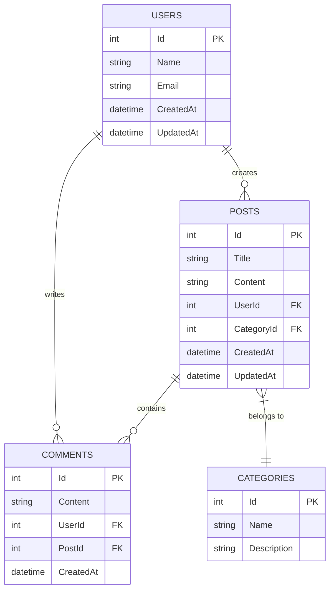

# .NET 9 REST API with Dapper, PostgreSQL, Clean Architecture

A modern .NET 9 REST API implementing CRUD operations for a blog system with Users, Posts, Comments, and Categories using Dapper as the micro-ORM, PostgreSQL as the database, and following Clean Architecture principles.

## Table of Contents
- [Features](#features)
- [Technology Stack](#technology-stack)
- [Architecture](#architecture)
- [Project Structure](#project-structure)
- [Prerequisites](#prerequisites)
- [Getting Started](#getting-started)
  - [Running with Docker](#running-with-docker)
  - [Running Locally](#running-locally)
- [API Endpoints](#api-endpoints)
- [Testing](#testing)
- [Database Schema](#database-schema)

## Features

- Full CRUD operations for Users, Posts, Comments, and Categories
- Clean Architecture with separation of concerns
- RESTful API design
- Asynchronous programming throughout
- Docker containerization support
- Swagger/OpenAPI documentation
- Comprehensive unit testing
- PostgreSQL database with Dapper micro-ORM

## Technology Stack

- **Framework**: .NET 9
- **Language**: C#
- **Database**: PostgreSQL
- **ORM**: Dapper (Micro-ORM)
- **Containerization**: Docker, Docker Compose
- **API Documentation**: Swagger/OpenAPI
- **Testing**: xUnit, Moq

## Architecture

This project follows Clean Architecture principles with four distinct layers:

```
┌─────────────────────────────────────────────────────────────┐
│                        API LAYER                            │
│  ┌───────────────────────────────────────────────────────┐  │
│  │                 Web API Controllers                   │  │
│  │  - REST endpoints                                     │  │
│  │  - Request/Response mapping                           │  │
│  │  - HTTP status codes                                  │  │
│  └───────────────────────────────────────────────────────┘  │
├─────────────────────────────────────────────────────────────┤
│                     APPLICATION LAYER                       │
│  ┌───────────────────────────────────────────────────────┐  │
│  │                    Use Cases                          │  │
│  │  - Business logic orchestration                       │  │
│  │  - Request validation                                 │  │
│  │  - DTO mapping                                        │  │
│  └───────────────────────────────────────────────────────┘  │
├─────────────────────────────────────────────────────────────┤
│                      DOMAIN LAYER                           │
│  ┌───────────────────────────────────────────────────────┐  │
│  │                    Entities                           │  │
│  │  - Core business objects                              │  │
│  │  - Business rules and validation                      │  │
│  └───────────────────────────────────────────────────────┘  │
├─────────────────────────────────────────────────────────────┤
│                    INFRASTRUCTURE LAYER                     │
│  ┌───────────────────────────────────────────────────────┐  │
│  │                  Data Access                          │  │
│  │  - Dapper repositories                                │  │
│  │  - Database connections                               │  │
│  │  - SQL queries                                        │  │
│  └───────────────────────────────────────────────────────┘  │
└─────────────────────────────────────────────────────────────┘
```

## Project Structure

```
src/
├── WebApi/                 # Presentation Layer (ASP.NET Core Web API)
│   ├── Controllers/        # API Controllers
│   ├── Extensions/         # Service collection extensions
│   ├── Properties/         # Launch settings
│   ├── appsettings.json    # Configuration
│   └── Program.cs          # Application entry point
├── Application/            # Application Layer
│   ├── DTOs/               # Data Transfer Objects
│   ├── Extensions/         # Service collection extensions
│   ├── Interfaces/         # Service interfaces
│   └── UseCases/           # Service implementations
├── Domain/                 # Domain Layer
│   ├── Entities/           # Business entities
│   └── Interfaces/         # Repository interfaces
├── Infrastructure/         # Infrastructure Layer
│   ├── Data/               # Database initialization
│   ├── Extensions/         # Service collection extensions
│   └── Repositories/       # Dapper repository implementations
tests/
├── Application.Tests/      # Application layer tests
├── Infrastructure.Tests/   # Infrastructure layer tests
└── WebApi.Tests/           # Web API layer tests
```

## Prerequisites

- [.NET 9 SDK](https://dotnet.microsoft.com/download/dotnet/9.0)
- [Docker](https://www.docker.com/products/docker-desktop) (for containerization)
- [PostgreSQL](https://www.postgresql.org/download/) (if running locally without Docker)

## Getting Started

### Running with Docker

The easiest way to run the application is with Docker Compose, which will start both the API and PostgreSQL database:

```bash
docker-compose up --build
```

The API will be available at: http://localhost:8081
Swagger documentation: http://localhost:8081/swagger

To stop the services:

```bash
docker-compose down
```

### Running Locally

1. **Set up the database**:
   Make sure PostgreSQL is running and create a database named `blogdb`.

2. **Update connection string** (if needed):
   Modify the connection string in `src/WebApi/appsettings.json`:
   ```json
   {
     "ConnectionStrings": {
       "DefaultConnection": "Host=localhost;Port=5432;Database=blogdb;Username=postgres;Password=your_password"
     }
   }
   ```

3. **Restore dependencies**:
   ```bash
   dotnet restore
   ```

4. **Build the project**:
   ```bash
   dotnet build
   ```

5. **Run the application**:
   ```bash
   dotnet run --project src/WebApi
   ```

   The API will be available at: https://localhost:5001 or http://localhost:5000
   Swagger documentation: https://localhost:5001/swagger

## API Endpoints

### Users
| Method | Endpoint        | Description           |
|--------|-----------------|-----------------------|
| GET    | `/api/users`    | Retrieve all users    |
| GET    | `/api/users/{id}`| Retrieve a user by ID |
| POST   | `/api/users`    | Create a new user     |
| PUT    | `/api/users/{id}`| Update a user         |
| DELETE | `/api/users/{id}`| Delete a user         |

### Posts
| Method | Endpoint        | Description           |
|--------|-----------------|-----------------------|
| GET    | `/api/posts`    | Retrieve all posts    |
| GET    | `/api/posts/{id}`| Retrieve a post by ID |
| POST   | `/api/posts`    | Create a new post     |
| PUT    | `/api/posts/{id}`| Update a post         |
| DELETE | `/api/posts/{id}`| Delete a post         |

### Categories
| Method | Endpoint             | Description              |
|--------|----------------------|--------------------------|
| GET    | `/api/categories`    | Retrieve all categories  |
| GET    | `/api/categories/{id}`| Retrieve a category by ID|
| POST   | `/api/categories`    | Create a new category    |
| PUT    | `/api/categories/{id}`| Update a category        |
| DELETE | `/api/categories/{id}`| Delete a category        |

### Comments
| Method | Endpoint            | Description             |
|--------|---------------------|-------------------------|
| GET    | `/api/comments`     | Retrieve all comments   |
| GET    | `/api/comments/{id}` | Retrieve a comment by ID|
| POST   | `/api/comments`     | Create a new comment    |
| PUT    | `/api/comments/{id}` | Update a comment        |
| DELETE | `/api/comments/{id}` | Delete a comment        |

## Testing

Run unit tests for the entire solution:

```bash
dotnet test
```

Run tests for a specific project:

```bash
dotnet test tests/Application.Tests
dotnet test tests/Infrastructure.Tests
dotnet test tests/WebApi.Tests
```

## Database Schema

The application uses the following entity relationship model:



## Contributing

1. Fork the repository
2. Create a feature branch (`git checkout -b feature/AmazingFeature`)
3. Commit your changes (`git commit -m 'Add some amazing feature'`)
4. Push to the branch (`git push origin feature/AmazingFeature`)
5. Open a pull request

## License

This project is licensed under the MIT License - see the [LICENSE](LICENSE) file for details.