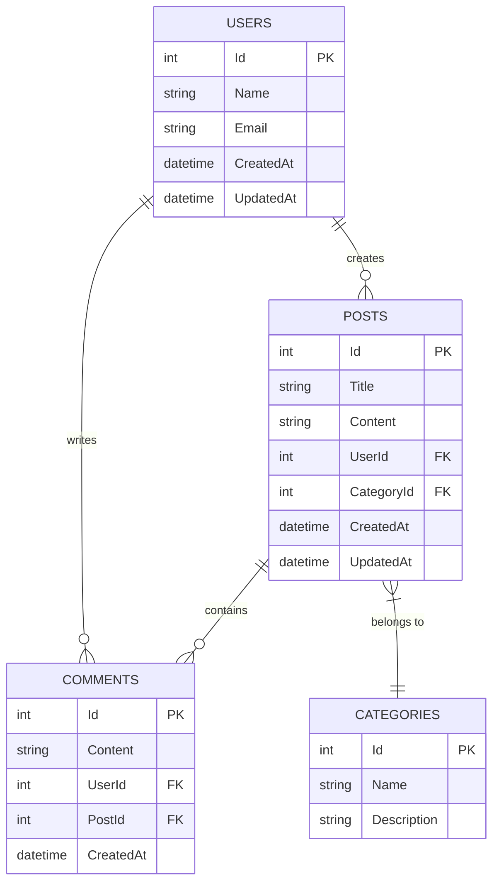

# .NET 9 REST API ด้วย Dapper, PostgreSQL, Clean Architecture

API สมัยใหม่ด้วย .NET 9 ที่ใช้ดำเนินการ CRUD สำหรับระบบบล็อกที่มีผู้ใช้ โพสต์ ความคิดเห็น และหมวดหมู่ โดยใช้ Dapper เป็น micro-ORM, PostgreSQL เป็นฐานข้อมูล และทำตามหลักการ Clean Architecture

## สารบบ
- [คุณสมบัติ](#คุณสมบัติ)
- [สแต็กเทคโนโลยี](#สแต็กเทคโนโลยี)
- [สถาปัตยกรรม](#สถาปัตยกรรม)
- [โครงสร้างโปรเจกต์](#โครงสร้างโปรเจกต์)
- [สิ่งที่ต้องมีก่อนเริ่ม](#สิ่งที่ต้องมีก่อนเริ่ม)
- [เริ่มต้นใช้งาน](#เริ่มต้นใช้งาน)
  - [การรันด้วย Docker](#การรันด้วย-docker)
  - [การรันในเครื่อง](#การรันในเครื่อง)
- [API Endpoints](#api-endpoints)
- [การทดสอบ](#การทดสอบ)
- [โครงสร้างฐานข้อมูล](#โครงสร้างฐานข้อมูล)

## คุณสมบัติ

- การดำเนินการ CRUD แบบเต็มสำหรับผู้ใช้ โพสต์ ความคิดเห็น และหมวดหมู่
- Clean Architecture ด้วยการแยกหน้าที่
- การออกแบบ RESTful API
- การเขียนโปรแกรมแบบอะซิงโครนัสตลอดทั้งระบบ
- รองรับการ containerization ด้วย Docker
- เอกสาร API ด้วย Swagger/OpenAPI
- การทดสอบหน่วยแบบครอบคลุม
- ฐานข้อมูล PostgreSQL ด้วย Dapper micro-ORM

## สแต็กเทคโนโลยี

- **Framework**: .NET 9
- **ภาษา**: C#
- **ฐานข้อมูล**: PostgreSQL
- **ORM**: Dapper (Micro-ORM)
- **Containerization**: Docker, Docker Compose
- **เอกสาร API**: Swagger/OpenAPI
- **การทดสอบ**: xUnit, Moq

## สถาปัตยกรรม

โปรเจกต์นี้ทำตามหลักการ Clean Architecture ด้วยการแบ่งเป็น 4 ชั้นที่ชัดเจน:

```
┌─────────────────────────────────────────────────────────────┐
│                        API LAYER                            │
│  ┌───────────────────────────────────────────────────────┐  │
│  │                 Web API Controllers                   │  │
│  │  - REST endpoints                                     │  │
│  │  - Request/Response mapping                           │  │
│  │  - HTTP status codes                                  │  │
│  └───────────────────────────────────────────────────────┘  │
├─────────────────────────────────────────────────────────────┤
│                     APPLICATION LAYER                       │
│  ┌───────────────────────────────────────────────────────┐  │
│  │                    Use Cases                          │  │
│  │  - Business logic orchestration                       │  │
│  │  - Request validation                                 │  │
│  │  - DTO mapping                                        │  │
│  └───────────────────────────────────────────────────────┘  │
├─────────────────────────────────────────────────────────────┤
│                      DOMAIN LAYER                           │
│  ┌───────────────────────────────────────────────────────┐  │
│  │                    Entities                           │  │
│  │  - Core business objects                              │  │
│  │  - Business rules and validation                      │  │
│  └───────────────────────────────────────────────────────┘  │
├─────────────────────────────────────────────────────────────┤
│                    INFRASTRUCTURE LAYER                     │
│  ┌───────────────────────────────────────────────────────┐  │
│  │                  Data Access                          │  │
│  │  - Dapper repositories                                │  │
│  │  - Database connections                               │  │
│  │  - SQL queries                                        │  │
│  └───────────────────────────────────────────────────────┘  │
└─────────────────────────────────────────────────────────────┘
```

## โครงสร้างโปรเจกต์

```
src/
├── WebApi/                 # Presentation Layer (ASP.NET Core Web API)
│   ├── Controllers/        # API Controllers
│   ├── Extensions/         # Service collection extensions
│   ├── Properties/         # Launch settings
│   ├── appsettings.json    # Configuration
│   └── Program.cs          # Application entry point
├── Application/            # Application Layer
│   ├── DTOs/               # Data Transfer Objects
│   ├── Extensions/         # Service collection extensions
│   ├── Interfaces/         # Service interfaces
│   └── UseCases/           # Service implementations
├── Domain/                 # Domain Layer
│   ├── Entities/           # Business entities
│   └── Interfaces/         # Repository interfaces
├── Infrastructure/         # Infrastructure Layer
│   ├── Data/               # Database initialization
│   ├── Extensions/         # Service collection extensions
│   └── Repositories/       # Dapper repository implementations
tests/
├── Application.Tests/      # Application layer tests
├── Infrastructure.Tests/   # Infrastructure layer tests
└── WebApi.Tests/           # Web API layer tests
```

## สิ่งที่ต้องมีก่อนเริ่ม

- [.NET 9 SDK](https://dotnet.microsoft.com/download/dotnet/9.0)
- [Docker](https://www.docker.com/products/docker-desktop) (สำหรับ containerization)
- [PostgreSQL](https://www.postgresql.org/download/) (หากจะรันในเครื่องโดยไม่ใช้ Docker)

## เริ่มต้นใช้งาน

### การรันด้วย Docker

วิธีที่ง่ายที่สุดในการรันแอปพลิเคชันคือใช้ Docker Compose ซึ่งจะเริ่มทั้ง API และฐานข้อมูล PostgreSQL:

```bash
docker-compose up --build
```

API จะสามารถเข้าถึงได้ที่: http://localhost:8081
เอกสาร Swagger: http://localhost:8081/swagger

เพื่อหยุด services:

```bash
docker-compose down
```

### การรันในเครื่อง

1. **ตั้งค่าฐานข้อมูล**:
   ตรวจสอบให้แน่ใจว่า PostgreSQL กำลังทำงานและสร้างฐานข้อมูลชื่อ `blogdb`

2. **อัปเดต connection string** (หากจำเป็น):
   แก้ไข connection string ใน `src/WebApi/appsettings.json`:
   ```json
   {
     "ConnectionStrings": {
       "DefaultConnection": "Host=localhost;Port=5432;Database=blogdb;Username=postgres;Password=your_password"
     }
   }
   ```

3. **คืนค่า dependencies**:
   ```bash
   dotnet restore
   ```

4. **สร้างโปรเจกต์**:
   ```bash
   dotnet build
   ```

5. **รันแอปพลิเคชัน**:
   ```bash
   dotnet run --project src/WebApi
   ```

   API จะสามารถเข้าถึงได้ที่: https://localhost:5001 หรือ http://localhost:5000
   เอกสาร Swagger: https://localhost:5001/swagger

## API Endpoints

### ผู้ใช้
| Method | Endpoint        | คำอธิบาย              |
|--------|-----------------|-----------------------|
| GET    | `/api/users`    | ดึงผู้ใช้ทั้งหมด       |
| GET    | `/api/users/{id}`| ดึงผู้ใช้ด้วย ID       |
| POST   | `/api/users`    | สร้างผู้ใช้ใหม่        |
| PUT    | `/api/users/{id}`| อัปเดตผู้ใช้          |
| DELETE | `/api/users/{id}`| ลบผู้ใช้              |

### โพสต์
| Method | Endpoint        | คำอธิบาย              |
|--------|-----------------|-----------------------|
| GET    | `/api/posts`    | ดึงโพสต์ทั้งหมด       |
| GET    | `/api/posts/{id}`| ดึงโพสต์ด้วย ID       |
| POST   | `/api/posts`    | สร้างโพสต์ใหม่        |
| PUT    | `/api/posts/{id}`| อัปเดตโพสต์          |
| DELETE | `/api/posts/{id}`| ลบโพสต์              |

### หมวดหมู่
| Method | Endpoint             | คำอธิบาย              |
|--------|----------------------|-----------------------|
| GET    | `/api/categories`    | ดึงหมวดหมู่ทั้งหมด     |
| GET    | `/api/categories/{id}`| ดึงหมวดหมู่ด้วย ID     |
| POST   | `/api/categories`    | สร้างหมวดหมู่ใหม่      |
| PUT    | `/api/categories/{id}`| อัปเดตหมวดหมู่        |
| DELETE | `/api/categories/{id}`| ลบหมวดหมู่            |

### ความคิดเห็น
| Method | Endpoint            | คำอธิบาย              |
|--------|---------------------|-----------------------|
| GET    | `/api/comments`     | ดึงความคิดเห็นทั้งหมด  |
| GET    | `/api/comments/{id}` | ดึงความคิดเห็นด้วย ID  |
| POST   | `/api/comments`     | สร้างความคิดเห็นใหม่   |
| PUT    | `/api/comments/{id}` | อัปเดตความคิดเห็น     |
| DELETE | `/api/comments/{id}` | ลบความคิดเห็น        |

## การทดสอบ

รัน unit tests สำหรับทั้งระบบ:

```bash
dotnet test
```

รัน tests สำหรับโปรเจกต์เฉพาะ:

```bash
dotnet test tests/Application.Tests
dotnet test tests/Infrastructure.Tests
dotnet test tests/WebApi.Tests
```

## โครงสร้างฐานข้อมูล

แอปพลิเคชันใช้โมเดลความสัมพันธ์ของเอนทิตีดังนี้:



## การมีส่วนร่วม

1. Fork 仓库
2. สร้าง feature branch (`git checkout -b feature/AmazingFeature`)
3. Commit การเปลี่ยนแปลง (`git commit -m 'Add some amazing feature'`)
4. Push ไปที่ branch (`git push origin feature/AmazingFeature`)
5. เปิด pull request

## ใบอนุญาต

โปรเจกต์นี้อยู่ภายใต้ใบอนุญาต MIT - ดูไฟล์ [LICENSE](LICENSE) สำหรับรายละเอียด